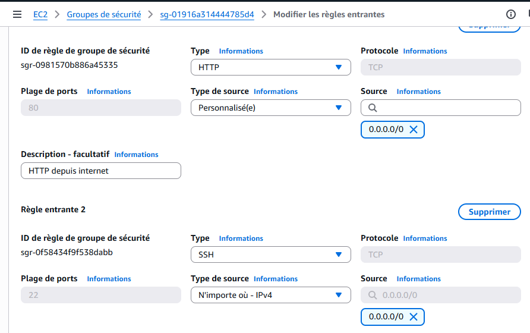
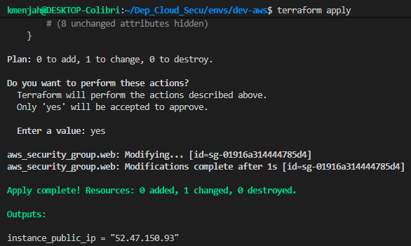
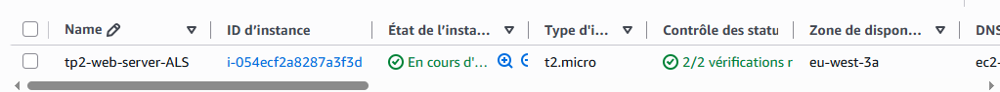
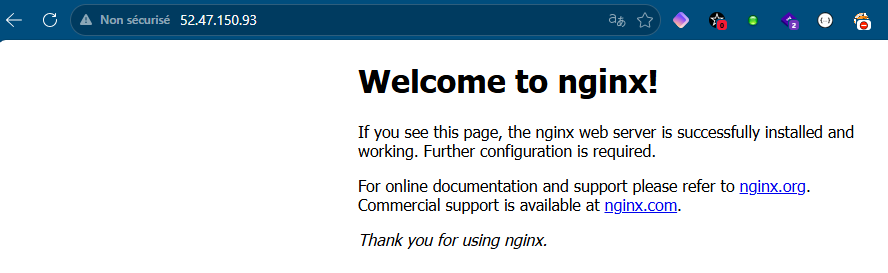
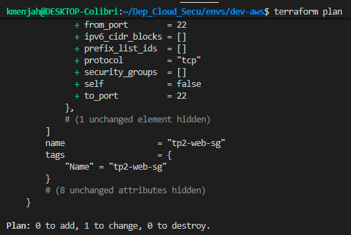
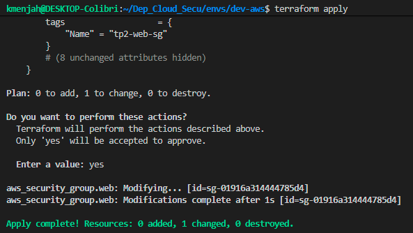
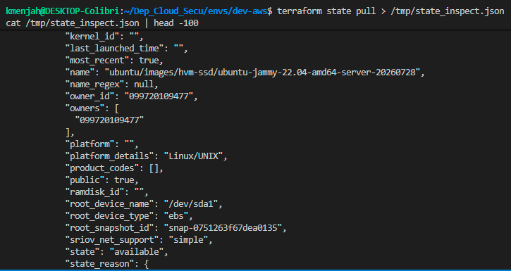
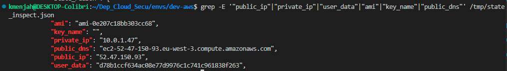
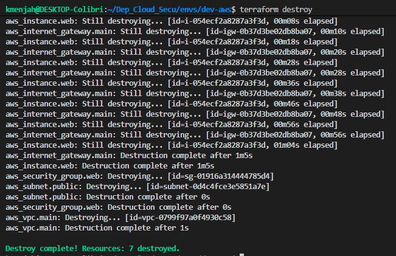

# TP2 — Rapport

**Déploiement multi-cloud sécurisé**
BC Design Systems · Mastère Cybersécurité 4A · IaC & Gestion des configurations

**Auteur :** Anne-Laure S.
**Dépôt :** `Dep_Cloud_Secu` — `envs/dev-aws`

> **Périmètre :** conformément à la consigne donnée en séance, seul le volet AWS de l'énoncé a été traité (Parties A, B et D). Le volet Azure (Partie C) n'a pas été réalisé.

---

## 1. Socle et état distant (Partie A)

Un bucket S3 dédié a été créé manuellement pour stocker l'état Terraform :

- Nom : `tf-state-alaure-747082607185` — région `eu-west-3`
- Versioning activé, Block Public Access (4 options activées), chiffrement SSE-S3 (AES256)

Backend Terraform configuré avec `encrypt = true` et `use_lockfile = true` (Terraform 1.15.8). `terraform init` exécuté avec succès : `.terraform.lock.hcl` créé et commité, `.terraform/` ignoré via `.gitignore`, de même que `*.tfstate*`, `*.tfplan` et `*.tfvars`.

## 2. Déploiement AWS (Partie B)

IP publique de l'opérateur récupérée via `curl -s https://checkip.amazonaws.com` (`203.0.113.42`), utilisée pour restreindre l'accès SSH.
> **Note** : l'IP `203.0.113.42` ci-dessus est une adresse anonymisée (plage `TEST-NET-3`, réservée par l'IANA à la documentation, RFC 5737) — l'IP publique réelle utilisée lors du TP a été remplacée avant publication de ce dépôt.

### 2.1 Ressources écrites

| Catégorie | Ressource Terraform | Configuration clé | Rôle |
|---|---|---|---|
| Réseau | `aws_vpc.main` | VPC dédié, CIDR 10.0.0.0/16, DNS support/hostnames activés | Isolation réseau du périmètre TP2 |
| Réseau | `aws_internet_gateway.main` | Passerelle internet attachée au VPC | Sortie/entrée internet du VPC |
| Réseau | `aws_subnet.public` | Sous-réseau public 10.0.1.0/24, AZ eu-west-3a, IP publique auto | Héberge l'instance web exposée |
| Réseau | `aws_route_table.public` + association | Route par défaut 0.0.0.0/0 vers l'IGW | Achemine le trafic public depuis/vers le subnet |
| Sécurité | `aws_security_group.web` | Ingress 80/tcp 0.0.0.0/0 ; ingress 22/tcp IP opérateur /32 ; egress all | Pare-feu : HTTP public, SSH restreint |
| Calcul | `aws_instance.web` | AMI `ami-0e207c18bb303cc68`, `t2.micro`, IMDSv2 requis, disque chiffré, user_data nginx | Serveur web nginx exposé publiquement |

### 2.2 Contrôles de sécurité obligatoires

- IMDSv2 imposé : `metadata_options.http_tokens = "required"`
- Disque racine chiffré : `root_block_device.encrypted = true` (gp3, 8 Go)
- SSH limité à l'IP de l'opérateur en `/32`, HTTP ouvert au public (`0.0.0.0/0`)


*Security Group tp2-web-sg : HTTP public, SSH restreint à l'IP de l'opérateur.*

### 2.3 Plan et application

Résultat du plan validé :

```
Plan: 7 to add, 0 to change, 0 to destroy.
(aws_vpc, aws_internet_gateway, aws_subnet, aws_route_table,
 aws_route_table_association, aws_security_group, aws_instance)
```

AMI (`ami-0e207c18bb303cc68`) et type d'instance (`t2.micro`) imposés par la liste blanche d'images validées sur le compte AWS de formation (principe de moindre privilège appliqué au niveau IAM).


*terraform apply : instance EC2 créée avec succès.*


*Output instance_public_ip exposé par Terraform.*

Accès HTTP vérifié avec succès dans un navigateur à l'adresse `http://52.47.150.93` :


*Page nginx par défaut accessible publiquement via l'IP de l'instance.*

## 3. Dérive, état et destruction (Partie D)

### 3.1 Dérive introduite manuellement

Modification manuelle dans la console AWS (EC2 → Security Groups → tp2-web-sg → Inbound rules) : règle SSH (port 22) changée de `203.0.113.42/32` vers `0.0.0.0/0`, reproduisant le geste risqué d'un opérateur pressé en production.

---

> ### 📦 LIVRABLE 1 — Le plan de la Partie D, avec interprétation de ce que Terraform a détecté

`terraform plan` (sans `-out`) exécuté après la modification manuelle :


*terraform plan détectant la dérive sur la règle SSH du Security Group.*

Résultat : `Plan: 0 to add, 1 to change, 0 to destroy` — seule la ressource `aws_security_group.web` est concernée.

**Interprétation :** avant toute action, Terraform rafraîchit l'état réel de l'infrastructure via l'API AWS puis le compare à l'état désiré défini dans le code. La modification faite dans la console a contourné Terraform (changement *out-of-band*), créant une dérive de configuration : l'infrastructure réelle ne correspondait plus au code versionné. Terraform a détecté précisément cet écart, limité à la règle ingress du port 22 (la règle HTTP du port 80 reste inchangée), et propose de restaurer la configuration conforme au code. `terraform plan` ne corrige rien par lui-même : seul un `terraform apply` réapplique la configuration et referme l'accès SSH. Cela illustre l'intérêt de l'IaC comme garde-fou : toute modification manuelle non tracée reste détectable et réversible tant que le code demeure la source de vérité.

Après vérification, `terraform apply` a corrigé la dérive :


*terraform apply restaurant la règle SSH restreinte à l'IP autorisée.*

---

> ### 📦 LIVRABLE 2 — Les trois informations sensibles trouvées dans le tfstate, et le contrôle qui protège ce fichier

Le fichier d'état a été inspecté via `terraform state pull` :


*Extraction des champs sensibles du tfstate (IP privée/publique, DNS, user_data).*

- **IP privée (10.0.1.47) et IP publique (52.47.150.93) :** révèlent la topologie réseau interne et exposent une cible atteignable depuis internet.
- **DNS public complet (ec2-52-47-150-93.eu-west-3.compute.amazonaws.com) :** confirme la région AWS exacte et facilite la reconnaissance en vue d'une attaque.
- **Champ user_data :** ici un hash (script nginx sans secret), mais ce champ contient très souvent en conditions réelles des secrets en clair (clés API, mots de passe, tokens).

**Contrôle qui protège ce fichier :** le tfstate n'est jamais stocké ni commité en local/Git (backend `s3` distant, `.gitignore` incluant `*.tfstate*`). Le bucket S3 dédié applique cumulativement Block Public Access (4 options), chiffrement SSE-S3 (AES256), versioning, et `encrypt = true` + `use_lockfile = true` côté backend. L'accès effectif dépend en dernier ressort des permissions IAM : seul un principal explicitement autorisé peut lire le tfstate.


*Protections activées sur le bucket S3 de l'état distant.*

---

> ### 📦 LIVRABLE 3 — Tableau comparatif AWS / Azure des ressources écrites, ligne par ligne

Le volet Azure n'ayant pas été traité (consigne du formateur : AWS uniquement), le tableau ci-dessous liste les ressources effectivement écrites côté AWS ; la colonne Azure est renseignée en conséquence.

| Catégorie | AWS (traité) | Azure |
|---|---|---|
| Réseau | VPC + Internet Gateway + subnet public + route table (`aws_vpc`, `aws_internet_gateway`, `aws_subnet`, `aws_route_table`) | Non traité — périmètre du TP limité à AWS sur consigne du formateur |
| Sécurité réseau | Security Group (HTTP 80 public, SSH 22 restreint /32) | Non traité |
| Calcul | Instance EC2 t2.micro, AMI imposée, IMDSv2 requis, disque racine chiffré, nginx via user_data | Non traité |
| État distant | Backend S3 (bucket versionné, chiffré, Block Public Access) + verrouillage natif (use_lockfile) | Non traité |

---

> ### 📦 LIVRABLE 4 — Question de fond : IMDSv2 et l'affaire Capital One (mars 2019) — 5 lignes maximum

IMDSv2 (`http_tokens = "required"`) aurait bloqué la technique exacte utilisée : la faille SSRF n'autorisait que des requêtes GET, incapables de forger le token de session exigé par une requête PUT préalable pour interroger le service de métadonnées et en extraire les identifiants IAM. En revanche, IMDSv2 n'aurait rien changé à la cause racine : ni à la faille SSRF elle-même dans le WAF, ni aux permissions IAM excessives du rôle de l'instance, qui ont permis d'accéder à un volume massif de données S3 une fois les identifiants obtenus.

---

> ### 📦 LIVRABLE 5 — Capture montrant que tout a bien été détruit

`terraform destroy` exécuté et confirmé :


*terraform destroy : suppression complète des 7 ressources créées.*

Les 7 ressources créées (instance, security group, association de table de routage, table de routage, subnet, internet gateway, VPC) ont été supprimées. Le bucket S3 de backend n'est pas concerné (créé manuellement en Partie A, non géré par ce state). L'accès au module de facturation AWS étant refusé pour ce compte étudiant (droits IAM restreints), la preuve retenue est la sortie explicite de `terraform destroy` confirmant la suppression des 7 ressources facturables.
